<div align="center">


# EcoleLangue

**Plateforme web de gestion d'une école de langues** : catalogue de cours, inscriptions en ligne, validation et suivi des paiements.


[Aperçu](#aperçu) · [Fonctionnalités](#fonctionnalités) · [Installation](#installation) · [Base de données](#base-de-données) · [Sécurité](#sécurité) · [Limites connues](#limites-connues)

</div>

---

## Aperçu

EcoleLangue met en relation deux types d'utilisateurs :

- **les étudiants** consultent les cours, créent un compte, envoient des demandes d'inscription et suivent leur statut ;
- **l'administrateur** gère le catalogue, valide ou annule les demandes, enregistre les paiements et consulte les étudiants.

<p align="center">
  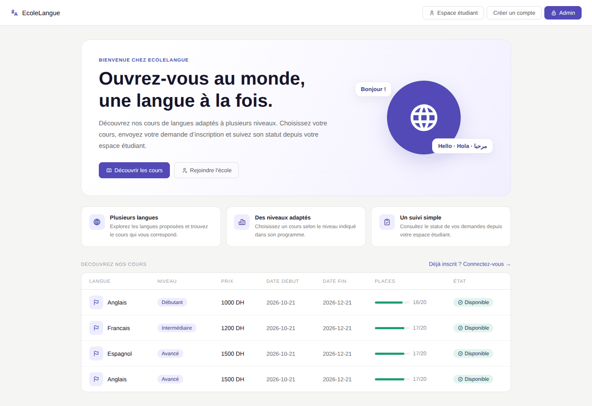
</p>

## Fonctionnalités

### Espace public
- Page d'accueil avec le catalogue des cours : langue, niveau, prix, dates, jauge de places et état (disponible / complet).
- Création de compte étudiant (CIN, nom, e-mail, téléphone, identifiant, mot de passe).

### Espace étudiant
- Connexion sécurisée et gestion du **profil** (nom, e-mail, téléphone).
- **Inscription** à un cours parmi ceux qui ont encore des places et qui n'ont pas commencé.
- **Mes demandes** : suivi du statut (*en attente*, *confirmé*, *annulé*) et du paiement ; annulation possible tant que la demande est en attente.

### Espace administrateur
- **Tableau de bord** : nombre d'étudiants, de cours, d'inscriptions, de paiements traités et demandes à traiter.
- **Validation** des demandes en attente : valider, annuler, marquer comme payé.
- **Gestion des cours** : ajout, modification, suppression (refusée si des inscriptions existent).
- **Inscriptions** : vue globale de toutes les inscriptions.
- **Étudiants** : liste avec recherche par nom, e-mail, identifiant ou CIN.

### Règles métier
- Le nombre de places restantes est décrémenté à chaque demande et **restitué** en cas d'annulation.
- Un étudiant ne peut pas s'inscrire deux fois au même cours (hors demande annulée).
- Un paiement ne peut être enregistré que pour une inscription **confirmée**.
- Les opérations sensibles sont exécutées en **transaction** avec verrouillage (`SELECT ... FOR UPDATE`) pour éviter les inscriptions concurrentes au-delà de la capacité.

## Captures d'écran

### Côté visiteur et authentification

| Créer un compte | Connexion étudiant | Connexion admin |
|:---:|:---:|:---:|
| 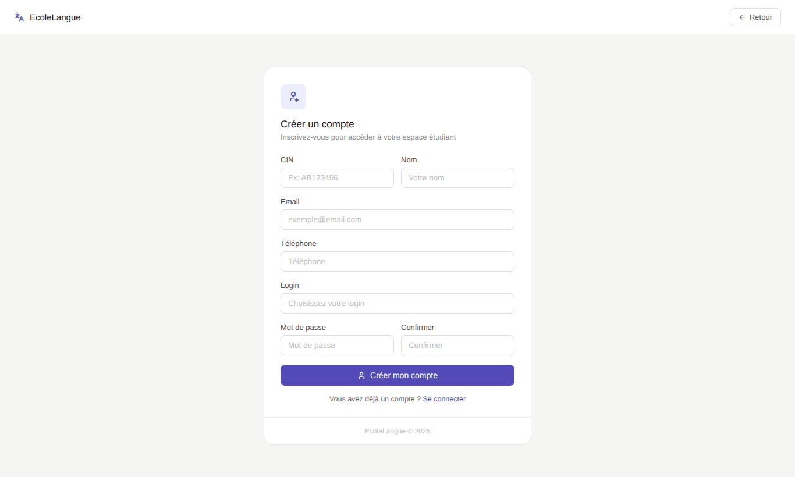 | 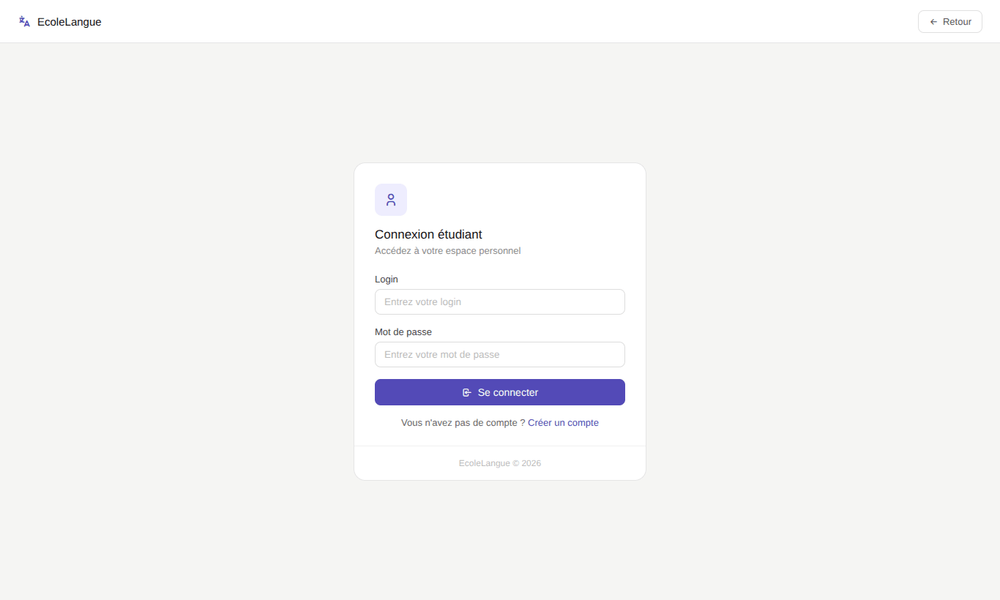 | 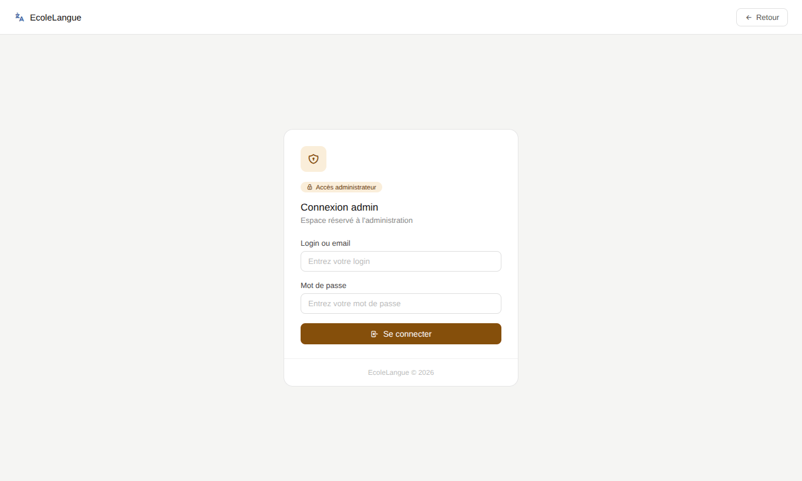 |

### Espace étudiant

| Profil | Inscription à un cours | Mes demandes |
|:---:|:---:|:---:|
| 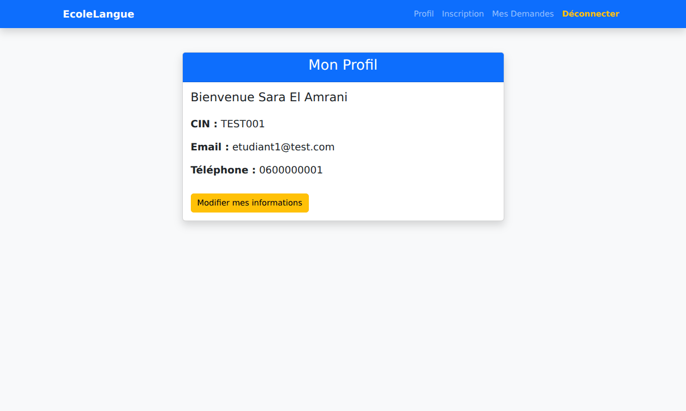 | 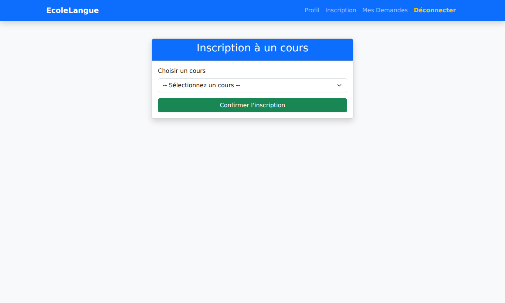 | 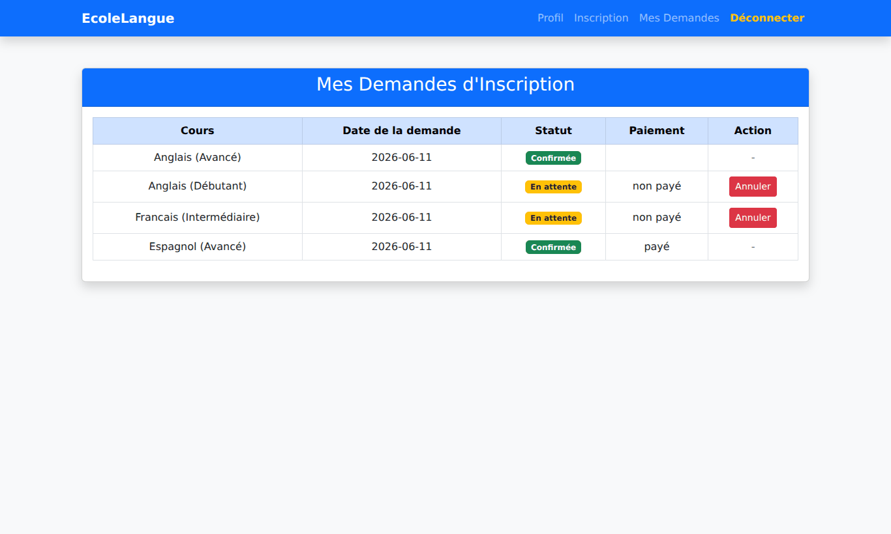 |

### Espace administrateur

**Tableau de bord**

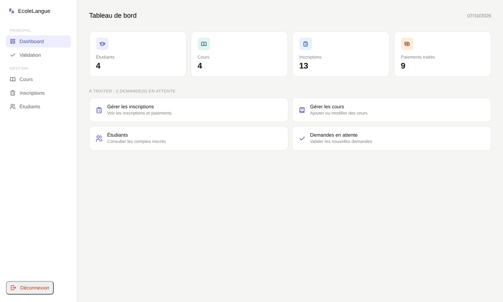

| Validation des demandes | Gestion des cours |
|:---:|:---:|
| 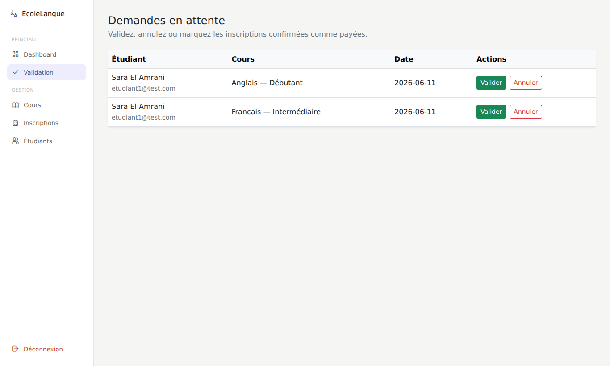 | 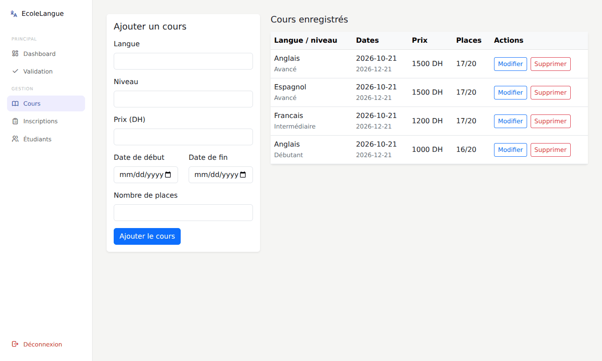 |

| Toutes les inscriptions | Étudiants |
|:---:|:---:|
| 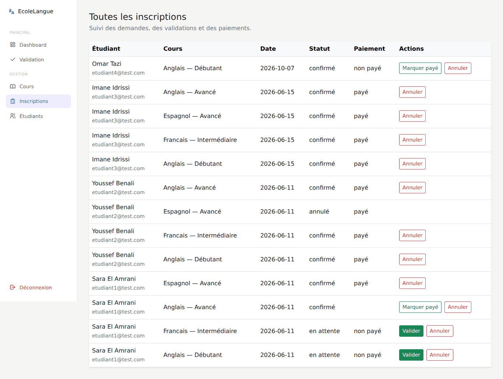 | 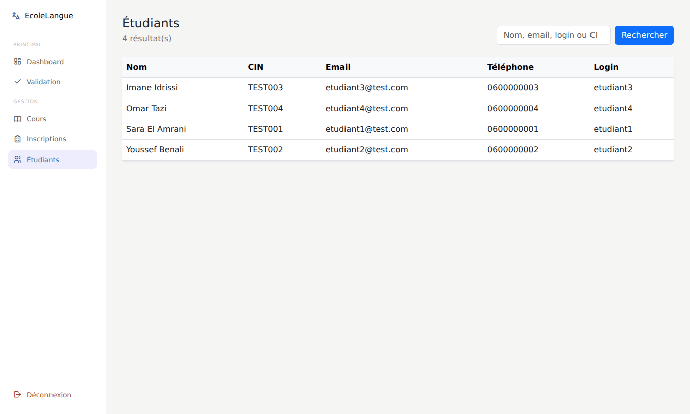 |

### Responsive

<p align="center">
  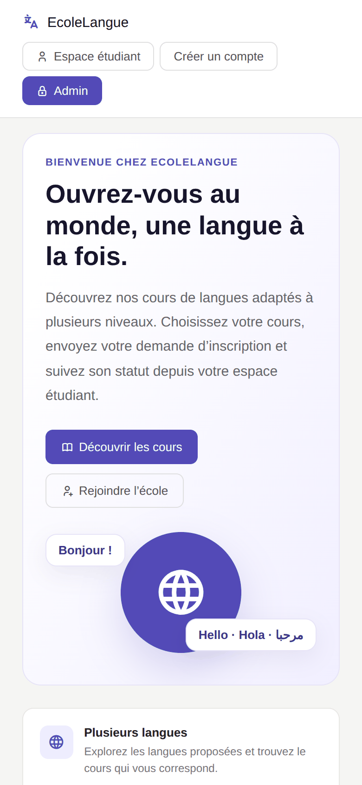
</p>

## Stack technique

| Couche | Technologie |
|---|---|
| Back-end | PHP 8 (procédural), PDO |
| Base de données | MySQL / MariaDB (InnoDB, utf8mb4) |
| Front-end | HTML5, CSS3, Bootstrap 5.3 (CDN) |
| Icônes | Tabler Icons (CDN) |
| Environnement conseillé | XAMPP / WAMP / Laragon ou `php -S` |

## Structure du projet

```text
project/
├── index.php               # Accueil + catalogue (inclut cours.php)
├── cours.php               # Liste des cours (composant)
├── creerCompte.php         # Inscription d'un étudiant
├── login.php               # Connexion étudiant
├── profile.php             # Profil étudiant
├── inscription.php         # Demande d'inscription à un cours
├── MesDemande.php          # Suivi des demandes de l'étudiant
├── delete.php              # Annulation d'une demande en attente
├── deconnecter.php         # Déconnexion étudiant
├── header.php              # Barre de navigation étudiant
│
├── loginAdmin.php          # Connexion administrateur
├── dashboard.php           # Tableau de bord
├── cousnonvalid.php        # Demandes en attente
├── actionInscription.php   # Valider / annuler / marquer payé
├── gestionCours.php        # CRUD des cours
├── inscriptionAdmin.php    # Toutes les inscriptions
├── etudiants.php           # Liste et recherche des étudiants
├── headerAdmin.php         # Barre latérale administrateur
├── deconnecterAdmin.php    # Déconnexion administrateur
│
├── db.php                  # Connexion PDO + fonctions utilitaires
├── database/
│   └── etablissement.sql   # Schéma + données de démonstration
└── docs/                   # Logo et captures d'écran du README
```

## Installation

### Prérequis
- PHP 8.0 ou plus, avec l'extension `pdo_mysql`
- MySQL ou MariaDB
- Un navigateur ayant accès à Internet (Bootstrap et Tabler Icons sont chargés via CDN)

### 1. Récupérer le projet

```bash
git clone <url-du-depot> ecolelangue
cd ecolelangue/project
```

Avec XAMPP, placez simplement le dossier `project` dans `htdocs/`.

### 2. Importer la base de données

```bash
mysql -u root -p -e "CREATE DATABASE etablissement CHARACTER SET utf8mb4;"
mysql -u root -p etablissement < database/etablissement.sql
```

Ou depuis phpMyAdmin : créez la base `etablissement`, puis **Importer** → `database/etablissement.sql`.

### 3. Configurer la connexion

Les paramètres se trouvent dans [`db.php`](db.php) :

```php
$dsn  = 'mysql:host=localhost;dbname=etablissement;charset=utf8mb4';
$user = 'root';
$pass = '';
```

> En production, utilisez un utilisateur dédié avec des droits limités et un mot de passe fort.

### 4. Lancer l'application

```bash
php -S localhost:8000
```

Puis ouvrez <http://localhost:8000/index.php> (ou `http://localhost/project/` avec XAMPP).

### 5. Définir les mots de passe de démonstration

Le fichier SQL contient un compte administrateur (identifiant `meed`) dont le mot de passe est **stocké sous forme de hash** : il n'est pas écrit dans le dépôt. Les étudiants de test ont un mot de passe factice (`...`) qui ne permet pas de se connecter.

Pour définir vos propres mots de passe :

```bash
php -r 'echo password_hash("VotreMotDePasse", PASSWORD_DEFAULT), PHP_EOL;'
```

```sql
UPDATE admin    SET password = '<hash>' WHERE login = 'meed';
UPDATE etudiant SET pass     = '<hash>' WHERE login = 'etudiant1';
```

Vous pouvez aussi créer un compte étudiant depuis la page **Créer un compte**.

## Base de données

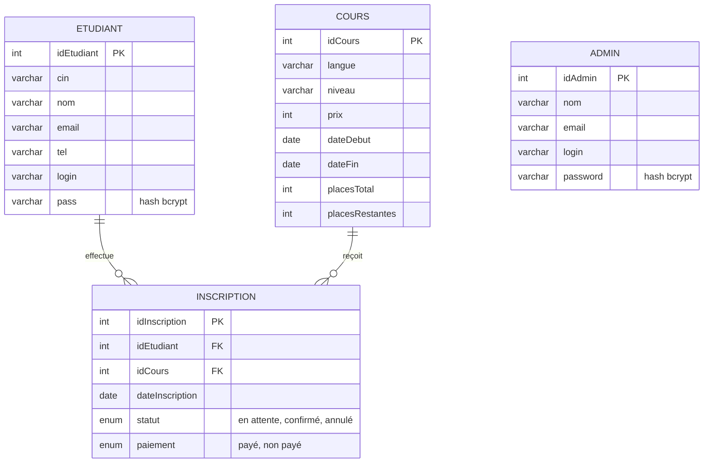

## Parcours d'une inscription

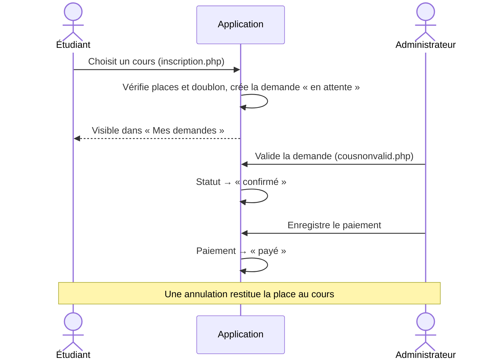

## Sécurité

- **Requêtes préparées PDO** (`ATTR_EMULATE_PREPARES => false`) sur les requêtes qui reçoivent des données utilisateur.
- **Mots de passe hachés** avec `password_hash()` et vérifiés avec `password_verify()`.
- **Jeton CSRF** sur les formulaires de connexion.
- **Échappement systématique** de la sortie HTML via la fonction `escape()` de `db.php`.
- **Contrôle d'accès par session** : chaque page étudiant ou administrateur redirige vers la connexion si la session est absente.
- **Transactions et verrouillage de lignes** pour garder des compteurs de places cohérents.

## Limites connues

Points relevés à la lecture du code, à traiter pour une mise en production :

- **Noms de tables et casse** : `dashboard.php` interroge `Etudiant`, `Cours` et `Inscription` (majuscule initiale) alors que les tables sont créées en minuscules. Cela fonctionne sous Windows (XAMPP), mais échoue sous Linux, où MySQL est sensible à la casse. Remplacez-les par `etudiant`, `cours` et `inscription`.
- **Données de démonstration** : trois lignes de la table `inscription` ont un `statut` ou un `paiement` vide, car le dump contient des valeurs hors `ENUM`. Corrigez-les avant d'utiliser les données.
- **CSRF** : seuls les formulaires de connexion sont protégés ; les actions d'administration (validation, paiement, suppression) devraient l'être aussi.
- **Dépendances CDN** : l'interface nécessite une connexion Internet. Pour un usage hors ligne, hébergez Bootstrap et Tabler Icons en local.
- **Identifiants de base de données** : `root` sans mot de passe est réservé au développement local.

## Pistes d'amélioration

- Réinitialisation du mot de passe par e-mail
- Export des inscriptions et paiements en CSV ou PDF
- Pagination et filtres sur les listes d'inscriptions
- Notifications par e-mail lors de la validation d'une demande
- Tests automatisés et intégration continue

## Author <br>
  **Mohamed** <br>
  GitHub: [@Mohamed4t]
---

<div align="center">
  <sub>EcoleLangue · Projet de gestion d'établissement de langues</sub>
</div>
